# Assignment 1 – Containerized Web Application with PostgreSQL using Docker Compose and Macvlan

This assignment demonstrates how to build and deploy a containerized Node.js web application connected to a PostgreSQL database using **Docker Compose**.  
The setup uses a **Macvlan network** to assign static IP addresses to containers and ensures **data persistence using Docker volumes**.

---

# Project Structure

```
assignment-1-containerized-webapp
│
├── backend
│   ├── server.js
│   ├── Dockerfile
│   ├── package.json
│   └── .dockerignore
│
├── database
│   ├── Dockerfile
│   └── init.sql
│
├── docker-compose.yml
└── README.md
```
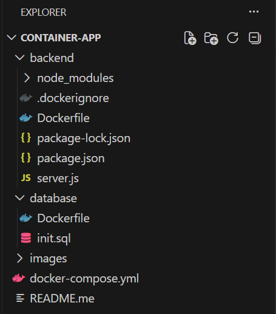
---

# Pre-requisite

- Docker installed
- Docker Compose installed
- Node.js installed
- Linux / WSL environment

---

# Step 1 – Initialize Node Package

```
npm init -y
```

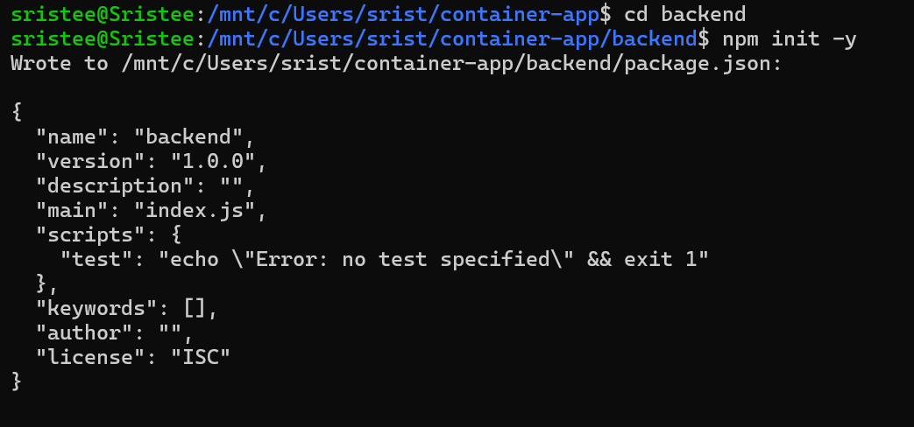

---

# Step 2 – Install Required Packages

```
npm i express pg
```

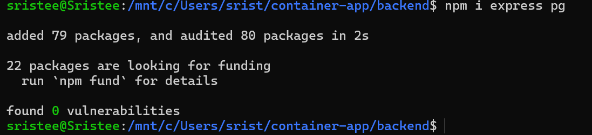

---

# Step 3 – package.json

After installing dependencies the `package.json` file will look like this.

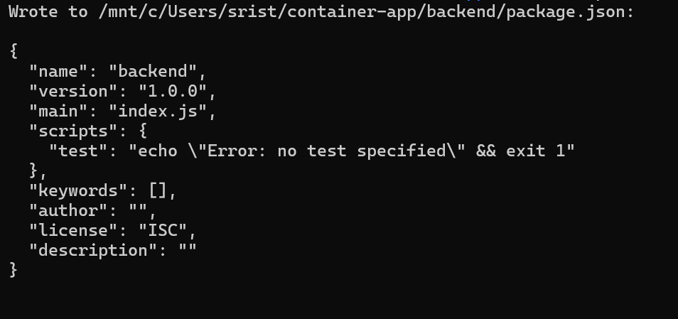

---

# Step 4 – Create Backend Server

Create `server.js`


```javascript
const express = require("express");
const { Pool } = require("pg");

const app = express();
app.use(express.json());

const pool = new Pool({
  host: process.env.DB_HOST,
  user: process.env.POSTGRES_USER,
  password: process.env.POSTGRES_PASSWORD,
  database: process.env.POSTGRES_DB,
  port: 5432
});

async function initDB() {
  await pool.query(`
    CREATE TABLE IF NOT EXISTS users(
        id SERIAL PRIMARY KEY,
        name TEXT
    )
  `);
}

initDB();

app.get("/health", (req, res) => {
  res.send("Server healthy");
});

app.post("/users", async (req, res) => {
  const { name } = req.body;

  const result = await pool.query(
    "INSERT INTO users(name) VALUES($1) RETURNING *",
    [name]
  );

  res.json(result.rows[0]);
});

app.get("/users", async (req, res) => {
  const result = await pool.query("SELECT * FROM users");
  res.json(result.rows);
});

app.listen(3000, "0.0.0.0", () => {
  console.log("Server running on port 3000");
});
```

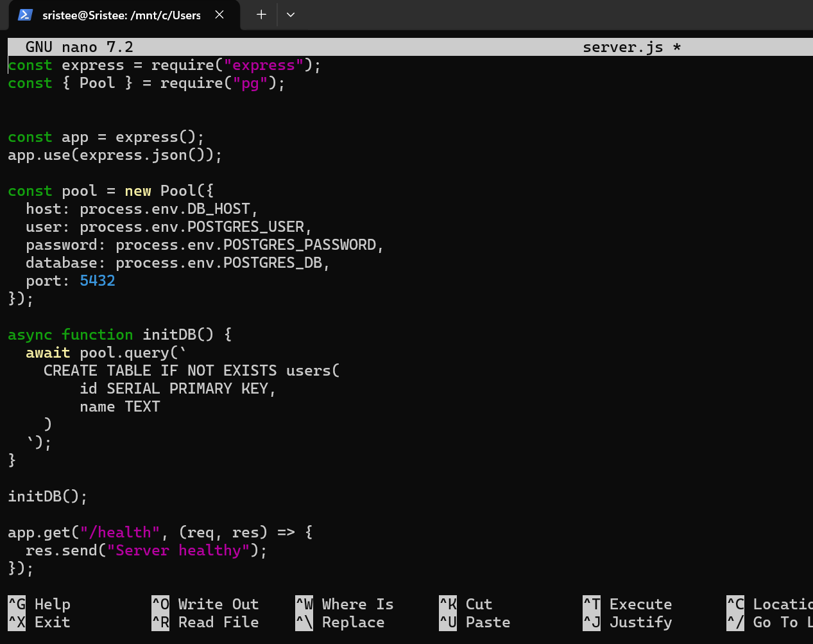

---

# Step 5 – Backend Dockerfile

Create `backend/Dockerfile`


```Dockerfile
# Builder Stage
FROM node:20-alpine AS builder

WORKDIR /app

COPY package*.json ./

RUN npm install --only=production

COPY . .

# Runtime Stage
FROM node:20-alpine

WORKDIR /app

RUN addgroup -S appgroup && adduser -S appuser -G appgroup

COPY --from=builder /app .

USER appuser

EXPOSE 3000

CMD ["node", "src/server.js"]
```

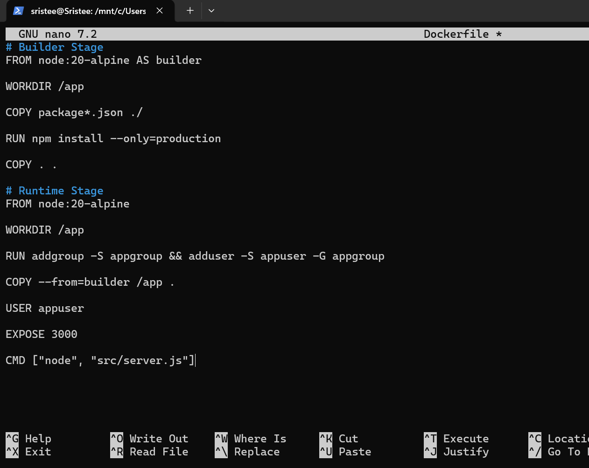

---

# Step 6 – .dockerignore

Create `.dockerignore`


```
node_modules
npm-debug.log
Dockerfile
.git
.gitignore
```

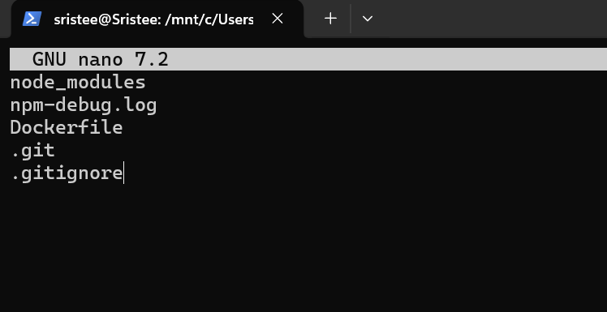

---

# Step 7 – Database Dockerfile

Create `database/Dockerfile`


```Dockerfile
FROM postgres:15-alpine

COPY init.sql /docker-entrypoint-initdb.d/
```

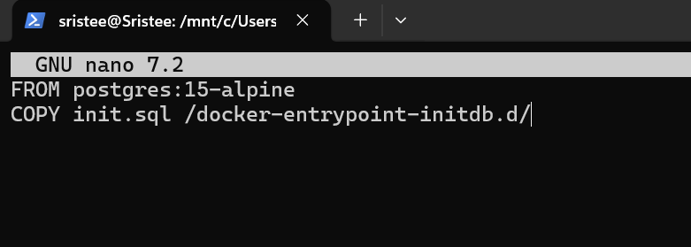

---

# Step 8 – Database Initialization Script

Create `init.sql`


```sql
CREATE TABLE IF NOT EXISTS users(
    id SERIAL PRIMARY KEY,
    name TEXT
);
```

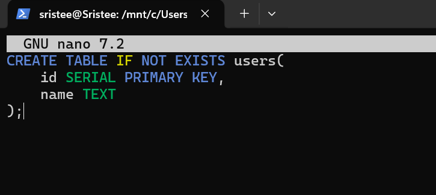

---

# Step 9 – Docker Compose Configuration

Create `docker-compose.yml`

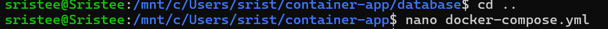

```yaml
version: "3.9"

services:

  database:
    build: ./database
    container_name: postgres_db
    restart: always

    environment:
      POSTGRES_DB: mydb
      POSTGRES_USER: admin
      POSTGRES_PASSWORD: dhairya

    volumes:
      - pgdata:/var/lib/postgresql/data

    networks:
      macvlan_net:
        ipv4_address: 192.168.50.21

    healthcheck:
      test: ["CMD-SHELL", "pg_isready -U admin"]
      interval: 10s
      retries: 5


  backend:
    build: ./backend
    container_name: node_backend
    restart: always

    environment:
      DB_HOST: 192.168.50.21
      POSTGRES_DB: mydb
      POSTGRES_USER: admin
      POSTGRES_PASSWORD: dhairya

    depends_on:
      database:
        condition: service_healthy

    networks:
      macvlan_net:
        ipv4_address: 192.168.50.20


volumes:
  pgdata:

networks:
  macvlan_net:
    external: true
```

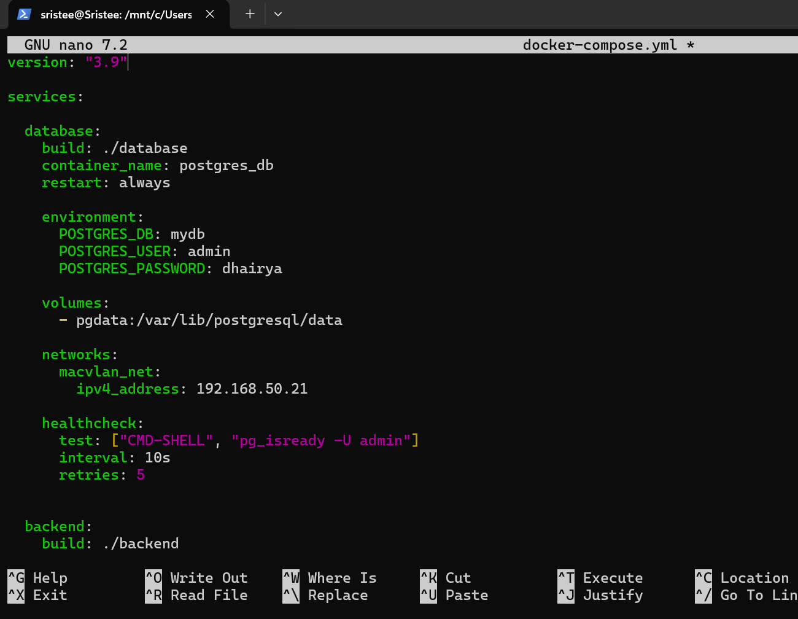

---

# Step 10 – Find Network Interface

```
ip a
```

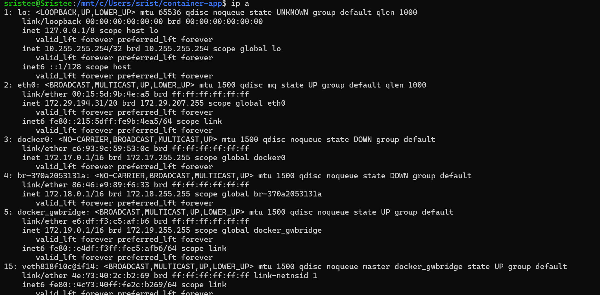

---

# Step 11 – Create Macvlan Network

```
docker network create -d macvlan \
--subnet=192.168.50.0/24 \
--gateway=192.168.50.1 \
-o parent=eth0 \
macvlan_net
```

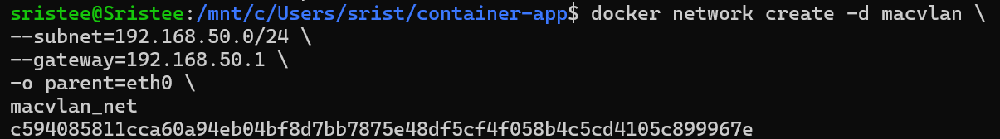

---

# Step 12 – Build Containers

```
docker-compose up --build --no-cache
```

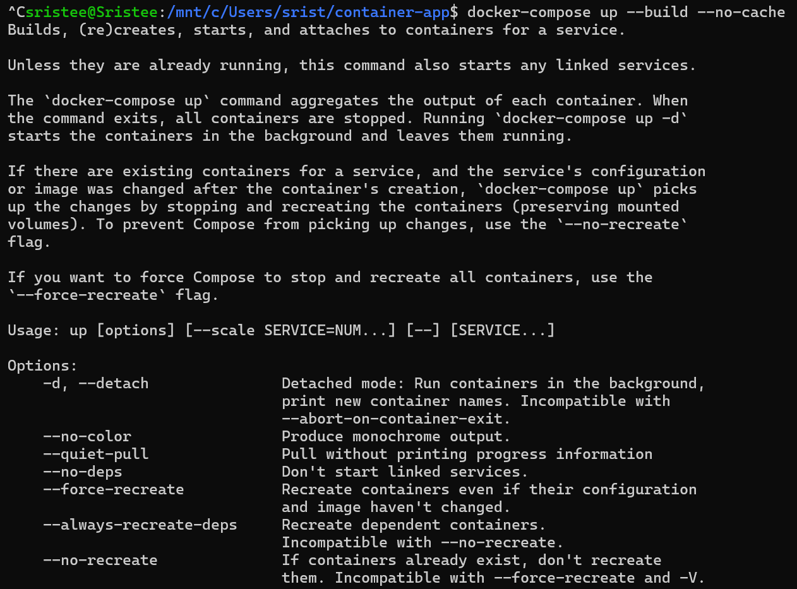

---

# Step 13 – Start Services

```
docker-compose up -d
```

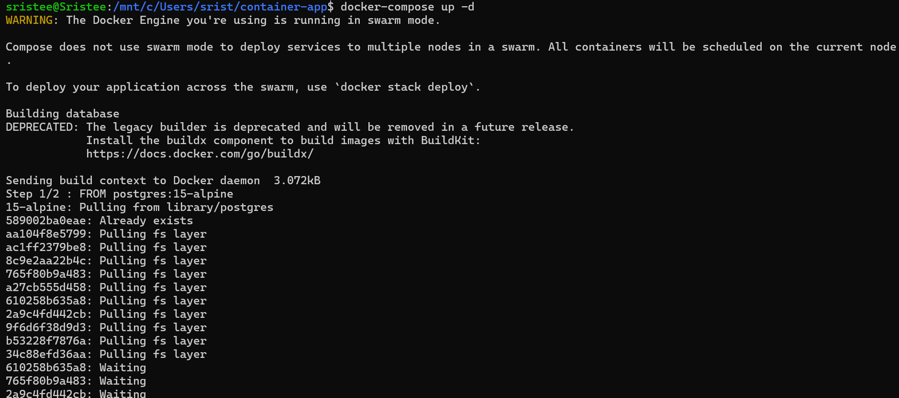
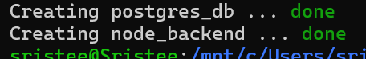

---

# Step 14 – Insert User Using API

```
curl -X POST http://192.168.50.20:3000/users \
-H "Content-Type: application/json" \
-d '{"name":"Sristee"}'
```

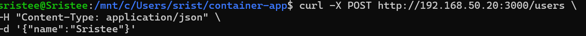

---

# Step 15 – Get Users

```
curl http://192.168.50.20:3000/users
```


---

# Step 16 – List Running Containers

```
docker ps
```

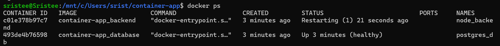

---

# Step 17 – List Docker Volumes

```
docker volume ls
```

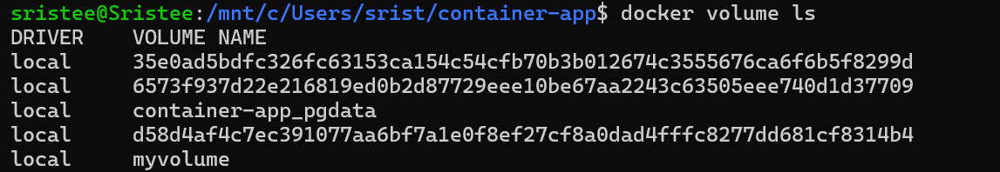

---

# Step 18 – Inspect Network

```
docker network inspect macvlan_net
```

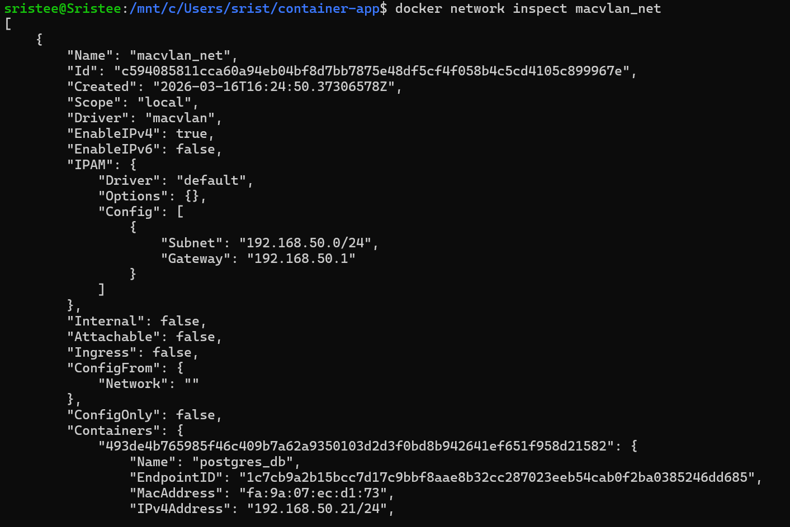

---

# Step 19 – Inspect Backend Container

```
docker inspect node_backend
```

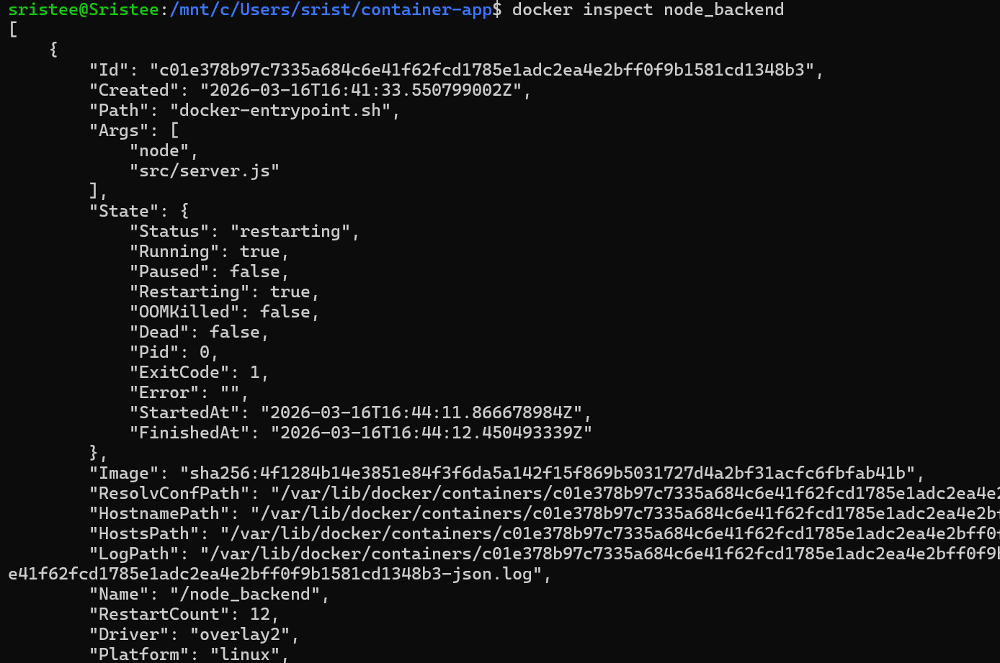

---

# Step 20 – Inspect Database Container

```
docker inspect postgres_db
```

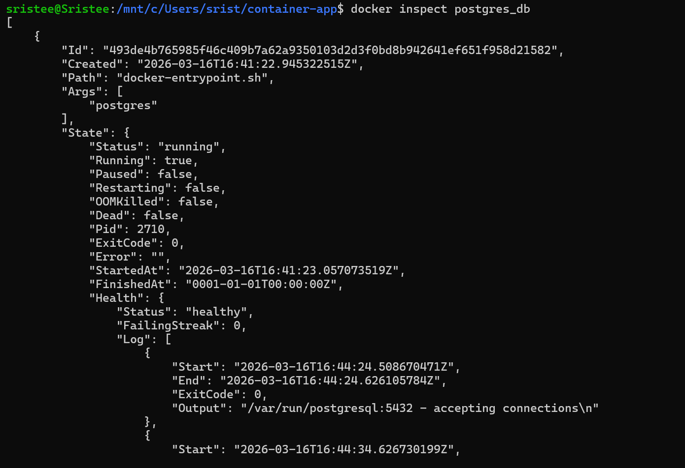

---

# Step 21 – Verify Data Persistence

```
docker-compose down
docker-compose up -d

```
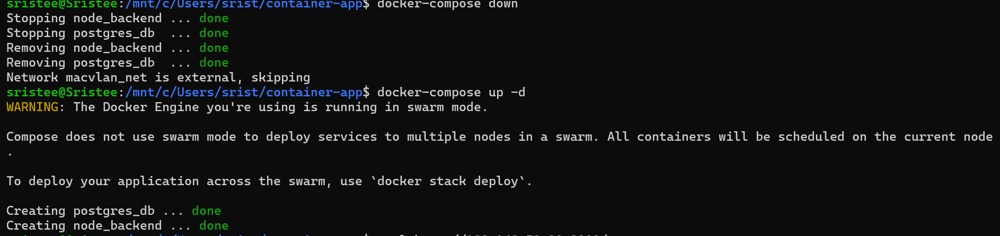

---

# Build Optimization Explanation

Several optimization techniques were used while building the Docker images.

**Multi-stage build** was used to separate dependency installation from runtime execution. This reduces the final image size by excluding unnecessary build tools.

A lightweight **node:20-alpine** base image was chosen instead of the standard Node.js image, which significantly reduces image size and improves container startup speed.

A `.dockerignore` file prevents unnecessary files such as `node_modules` and `.git` from being copied into the container image.

Finally, the container runs using a **non-root user**, improving application security.

---

# Image Size Comparison

| Image | Size |
|------|------|
| node:20 | ~1.1 GB |
| node:20-alpine | ~180 MB |

Using Alpine significantly reduces storage requirements and download time.

---

# Macvlan vs IPvlan

| Feature | MACVLAN | IPVLAN |
|--------|--------|--------|
| MAC addresses | One per container | One shared |
| Network switch load | Higher | Lower |
| Scalability | Limited by switch | Higher |
| Best for | Small deployments | Large-scale |

---

# Conclusion

This assignment demonstrates how to containerize a full-stack application using Docker and Docker Compose.  
It also highlights advanced networking using Macvlan and ensures persistent database storage using Docker volumes.