## Experiment 5:- Docker - Volumes, Environment Variables, Monitoring & Networks  

---

<h4 align="center"> Part 1: Docker Volumes - Persistent Data Storage </h4>

---

### Lab 1: Understanding Data Persistence  

**The Problem: Container Data is Ephemeral**

```bash
docker run -it --name test-container ubuntu /bin/bash
```


```bash
echo "Hello World" > /data/message.txt
cat /data/message.txt
exit
```
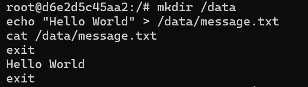

```bash
docker start test-container
docker exec test-container cat /data/message.txt
```
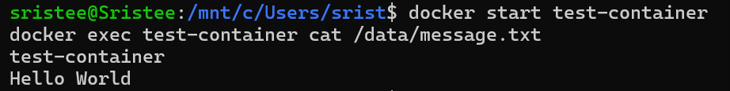

**Solution: Docker Volumes**

---

### Lab 2: Volume Types  

#### Anonymous Volume
```bash
docker run -d -v /app/data --name web1 nginx
docker volume ls
docker inspect web1
```
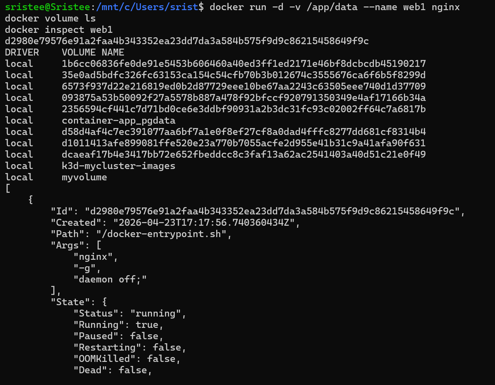

#### Named Volume
```bash
docker volume create mydata
docker run -d -v mydata:/app/data --name web2 nginx
docker volume ls
docker volume inspect mydata
```
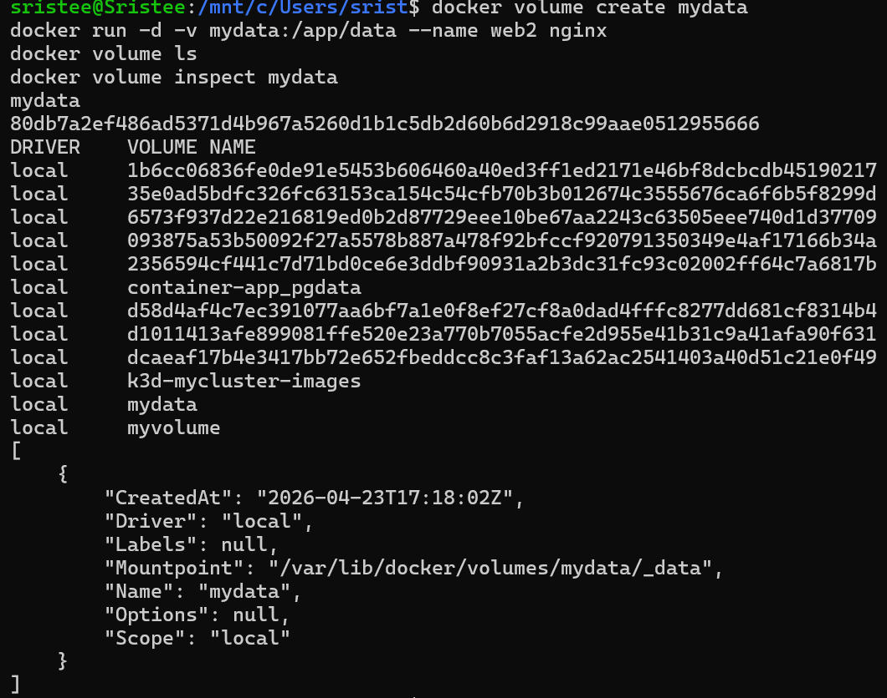

#### Bind Mount
```bash
mkdir ~/myapp-data
docker run -d -v ~/myapp-data:/app/data --name web3 nginx
echo "From Host" > ~/myapp-data/host-file.txt
docker exec web3 cat /app/data/host-file.txt
```
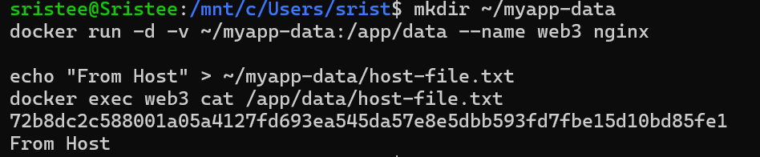
---

### Lab 3: Practical Examples  

#### MySQL Persistent Storage
```bash
docker run -d \
  --name mysql-db \
  -v mysql-data:/var/lib/mysql \
  -e MYSQL_ROOT_PASSWORD=secret \
  mysql:8.0
```
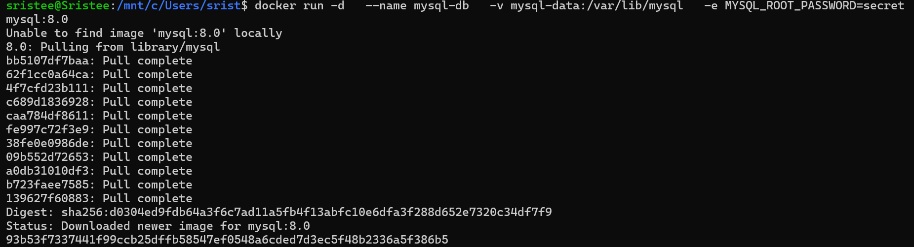

```bash
docker stop mysql-db
docker rm mysql-db
```
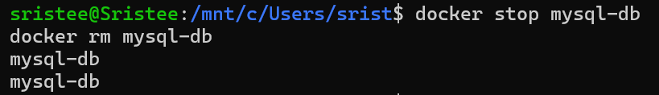

```bash
docker run -d \
  --name new-mysql \
  -v mysql-data:/var/lib/mysql \
  -e MYSQL_ROOT_PASSWORD=secret \
  mysql:8.0
```
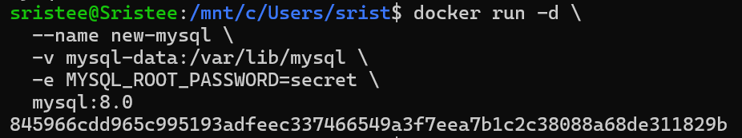

#### NGINX Config Mount
```bash
mkdir ~/nginx-config
```
```bash
echo 'server {
    listen 80;
    location / {
        return 200 "Hello from mounted config!";
    }
}' > ~/nginx-config/nginx.conf
```
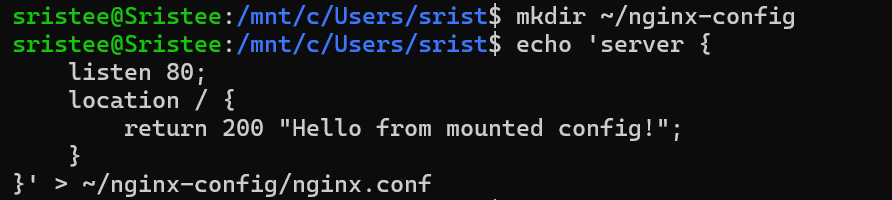
```bash
docker run -d \
  --name nginx-custom \
  -p 8080:80 \
  -v ~/nginx-config/nginx.conf:/etc/nginx/conf.d/default.conf \
  nginx
```
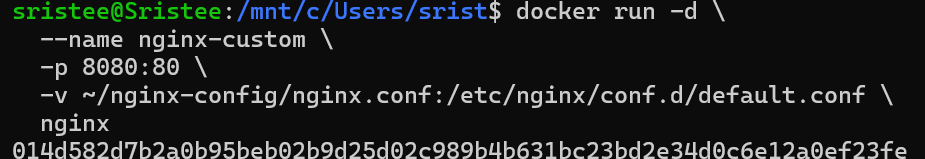
```bash
curl http://localhost:8080
```
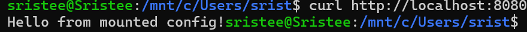
---

### Lab 4: Volume Commands  

```bash
docker volume ls
```
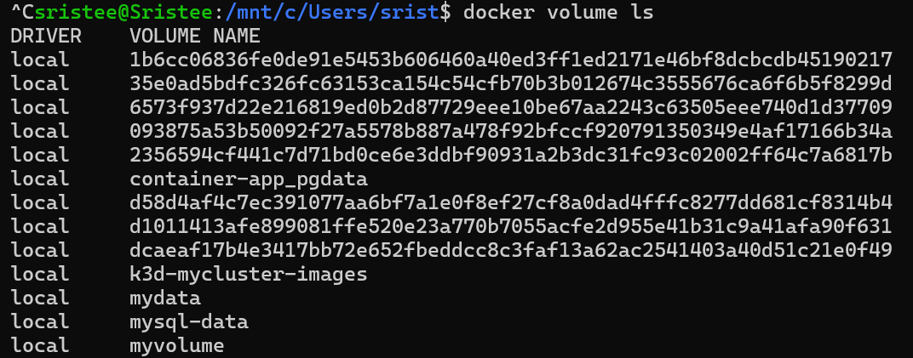
```bash
docker volume create app-volume
```
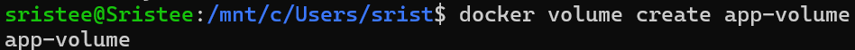
```bash
docker volume inspect app-volume
```
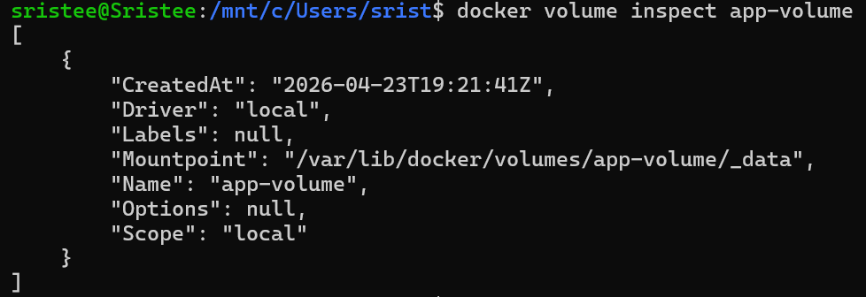
```bash
docker volume prune
```
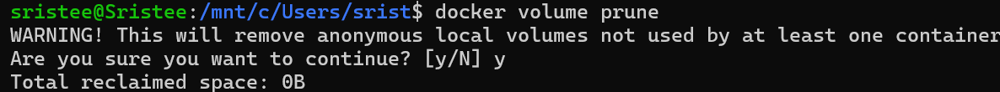
```bash
docker volume rm volume-name
```
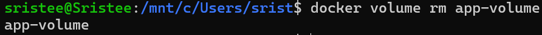
```bash
docker cp local-file.txt container-name:/path/in/volume
```

---

<h4 align="center"> Part 2: Environment Variables </h4>
---

### Setting Variables  

```bash
docker run -d \
  --name app1 \
  -e DATABASE_URL="postgres://user:pass@db:5432/mydb" \
  -e DEBUG="true" \
  my-node-app
```
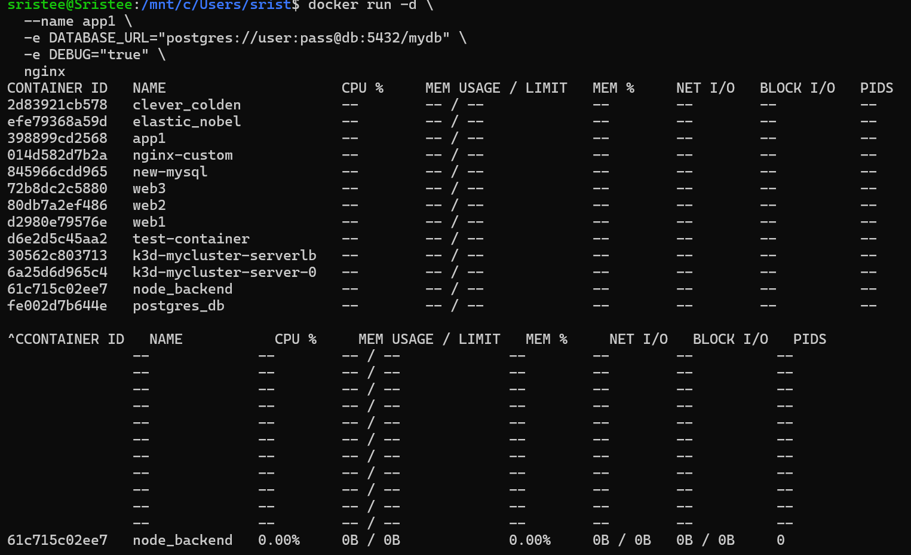

### Using .env File  

```bash
echo "DATABASE_HOST=localhost" > .env
echo "API_KEY=secret123" >> .env
```

```bash
docker run -d --env-file .env my-app
```

### Dockerfile Example  

```Dockerfile
ENV NODE_ENV=production
ENV PORT=3000
```

---

### Flask Example  

```python
import os
from flask import Flask

app = Flask(__name__)

@app.route('/config')
def config():
    return {
        "db": os.environ.get("DATABASE_HOST"),
        "debug": os.environ.get("DEBUG")
    }

app.run(host="0.0.0.0", port=5000)
```

---

### Test Variables  

```bash
docker run -d \
  --name flask-app \
  -p 5000:5000 \
  -e DEBUG=true \
  flask-app

docker exec flask-app env
curl http://localhost:5000/config
```

---

<h4 align="center"> Part 3: Docker Monitoring </h4>

---

```bash
docker stats
docker stats --no-stream

docker top container-name

docker logs -f container-name

docker inspect container-name

docker events
```

---

### Simple Monitoring Script  

```bash
#!/bin/bash
docker ps
docker stats --no-stream
docker system df
```

---

<h4 align="center"> Part 4: Docker Networks </h4>

---

### List Networks  

```bash
docker network ls
```

### Bridge Network  

```bash
docker network create my-network

docker run -d --name web1 --network my-network nginx
docker run -d --name web2 --network my-network nginx

docker exec web1 curl http://web2
```
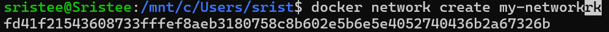
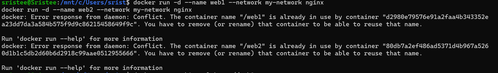
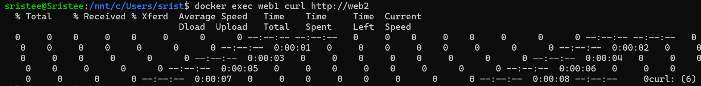

### Host Network  

```bash
docker run -d --network host nginx
```
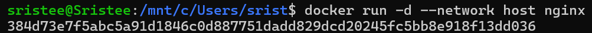

### None Network  

```bash
docker run -d --network none alpine sleep 3600
```
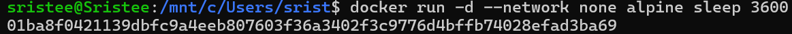
---

### Network Commands  

```bash
docker network create app-network
docker network connect app-network container-name
docker network disconnect app-network container-name
docker network rm app-network
```

---

### Multi-Container Example  

```bash
docker network create app-network

docker run -d \
  --name postgres-db \
  --network app-network \
  -e POSTGRES_PASSWORD=secret \
  postgres:15

docker run -d \
  --name web-app \
  --network app-network \
  -p 8080:3000 \
  -e DATABASE_HOST="postgres-db" \
  node-app
```
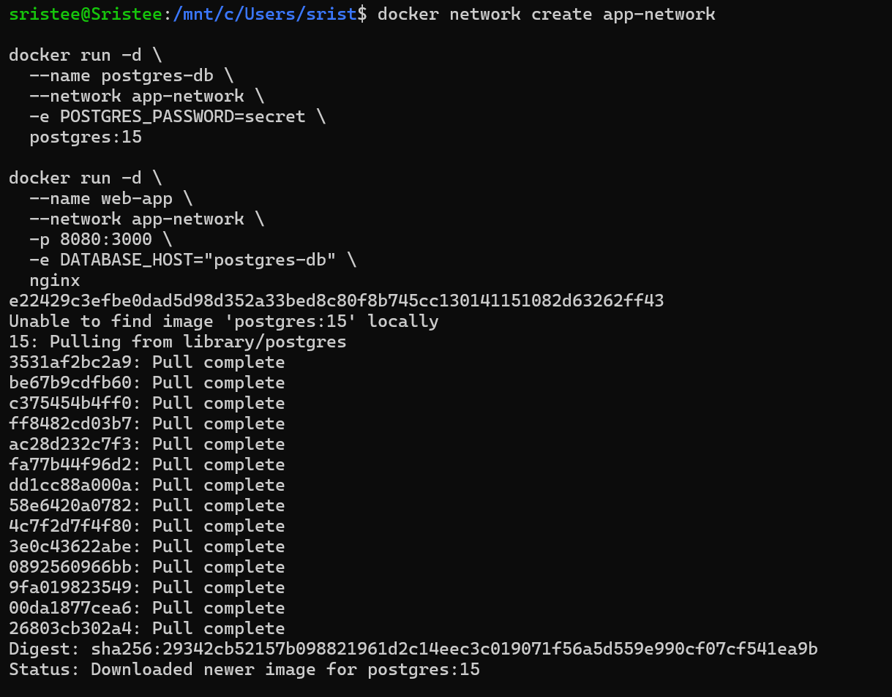
---

### Debugging  

```bash
docker network inspect bridge
docker exec container-name ping google.com
docker port container-name
```

---

<h4 align="center"> Part 5: Real-World Example </h4>

---

```bash
docker network create myapp-network

docker run -d \
  --name postgres \
  --network myapp-network \
  -e POSTGRES_PASSWORD=pass \
  postgres:15

docker run -d \
  --name redis \
  --network myapp-network \
  redis:7-alpine

docker run -d \
  --name flask-app \
  --network myapp-network \
  -p 5000:5000 \
  flask-app:latest
```

---

<h4 align="center"> Cheatsheet </h4>

---

```bash
docker volume create <name>
docker run -v <volume>:/path

docker run -e VAR=value

docker stats
docker logs -f <container>

docker network create <name>
```

---

<h4 align="center"> Practice </h4>

---

- Create DB with volume  
- Multi-service setup  
- Analyze logs  
- Network isolation  

---

<h4 align="center"> Cleanup </h4>

---

```bash
docker stop $(docker ps -aq)
docker rm $(docker ps -aq)
docker volume prune -f
docker network prune -f
docker image prune -f
```
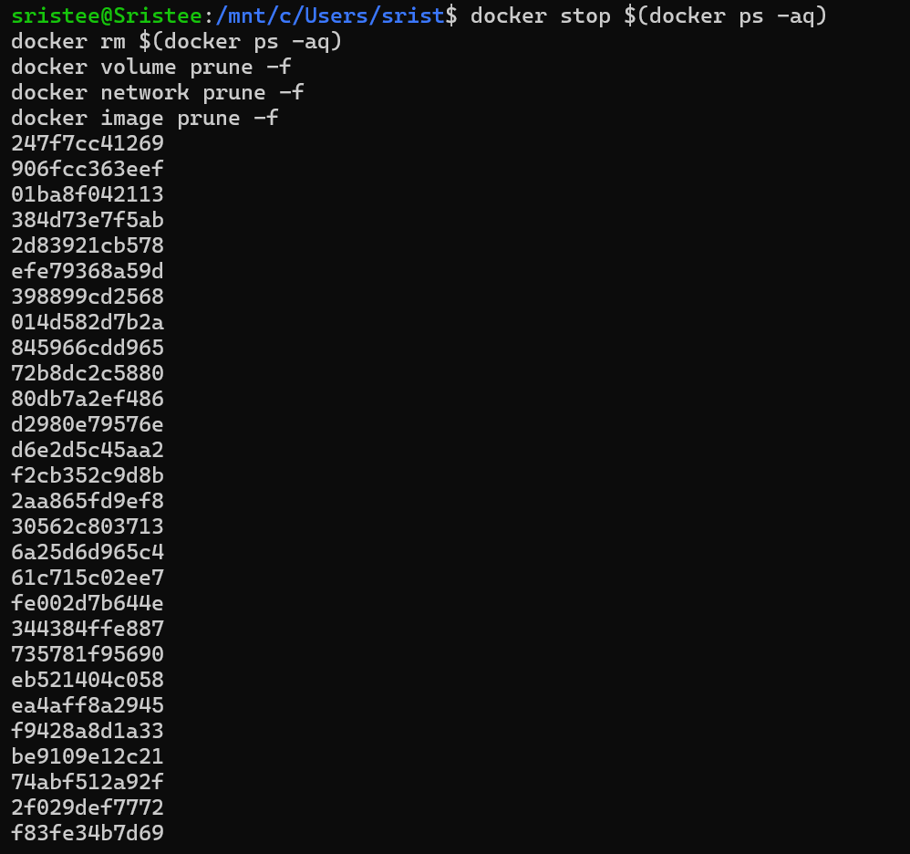
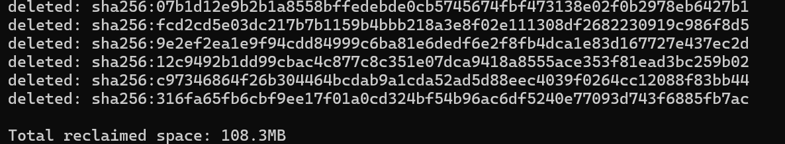
---

<h4 align="center"> Key Takeaways </h4>

---

- Volumes store persistent data  
- Env variables control config  
- Monitoring helps debugging  
- Networks connect containers  
- Use .env for security  