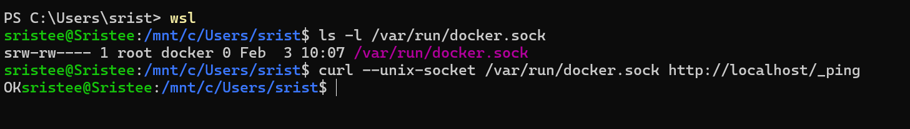
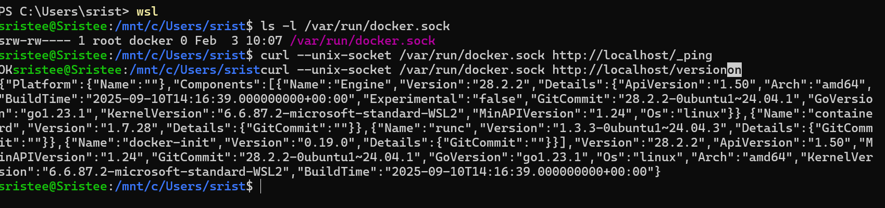
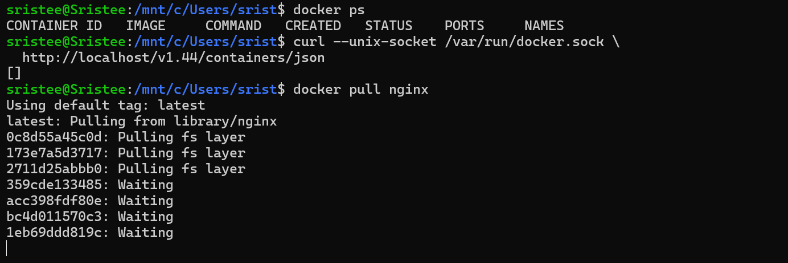
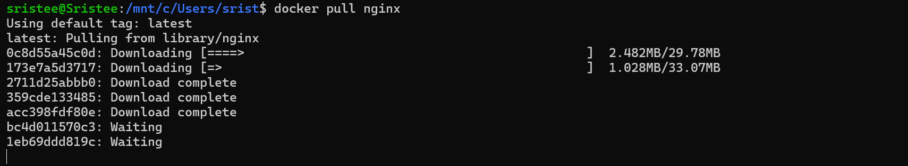
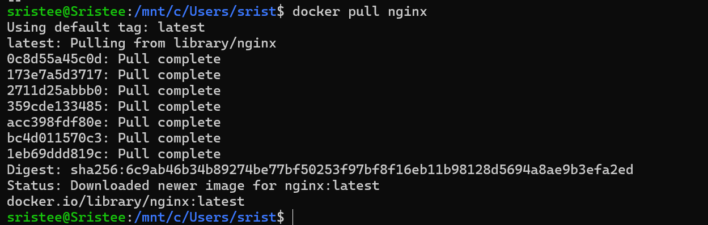

# 🐳 Docker API & Image Management – Class Task

---

## 🛠️ Technologies Used  
- Docker  
- WSL (Windows Subsystem for Linux)  
- cURL  
- Nginx  

---

## ⚙️ Steps Performed  

### 1️⃣ Start WSL  
```bash
wsl
```

---

### 2️⃣ Verify Docker Socket  
```bash
ls -l /var/run/docker.sock
```

---

### 3️⃣ Check Docker Daemon (Ping Test)  
```bash
curl --unix-socket /var/run/docker.sock http://localhost/_ping
```

**Output:**  
```
OK
```

---

### 4️⃣ Get Docker Version using API  
```bash
curl --unix-socket /var/run/docker.sock http://localhost/version
```

---

### 5️⃣ List Running Containers using API  
```bash
curl --unix-socket /var/run/docker.sock \
http://localhost/v1.44/containers/json
```

**Output:**  
```
[]
```

---

### 6️⃣ Check Running Containers (CLI)  
```bash
docker ps
```

---

### 7️⃣ Pull Nginx Image  
```bash
docker pull nginx
```

---

## ⚠️ Notes  
- Docker socket is used for direct communication with Docker daemon  
- cURL allows accessing Docker REST API without Docker CLI  
- No containers were running initially  
- Nginx image was successfully downloaded from Docker Hub  

---

## ✅ Outcome  
- Verified Docker daemon using socket  
- Accessed Docker API endpoints  
- Retrieved system and container information  
- Successfully pulled Nginx image  

---

## 📸 Screenshots  

> all screenshots below:





