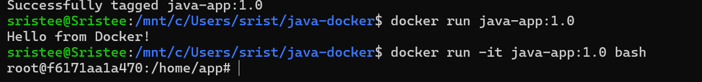
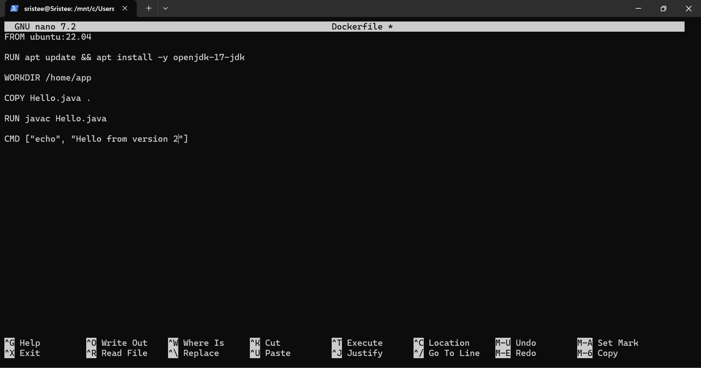
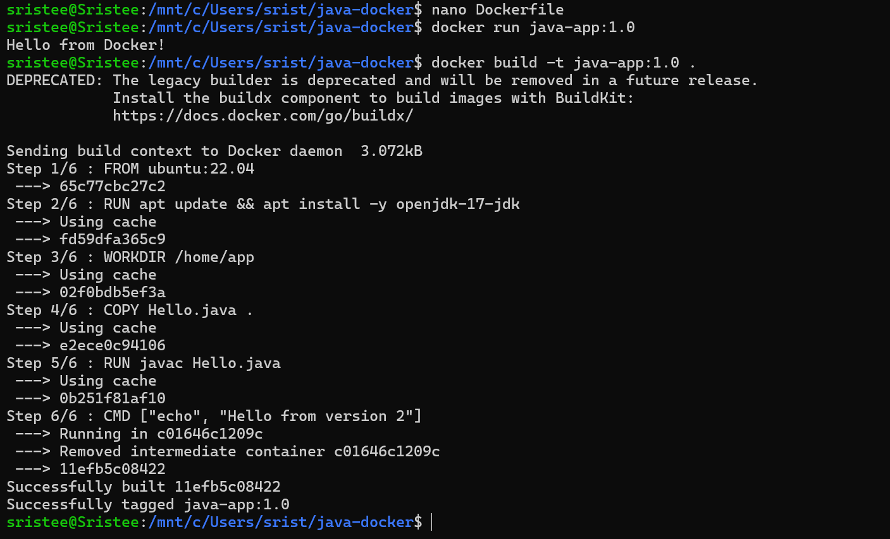
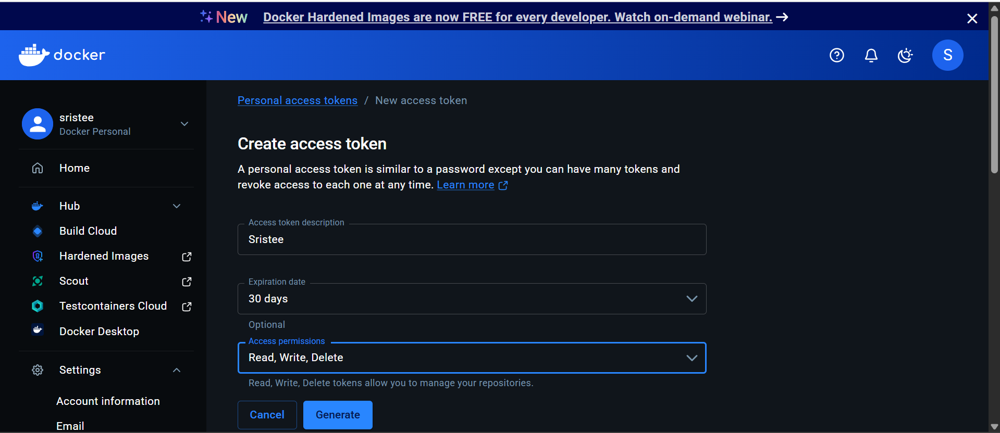
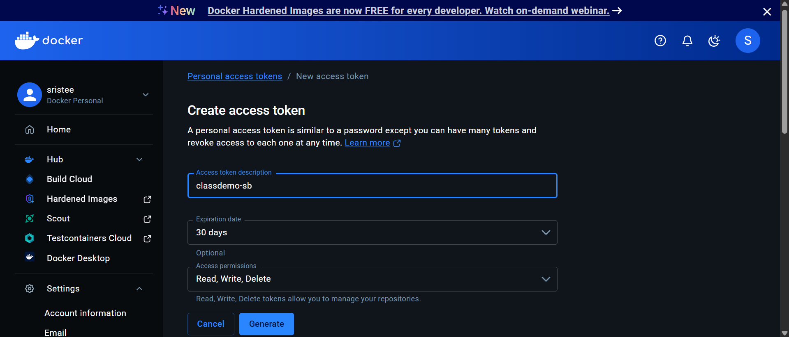
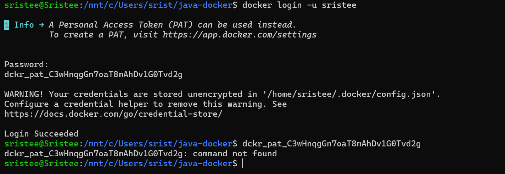
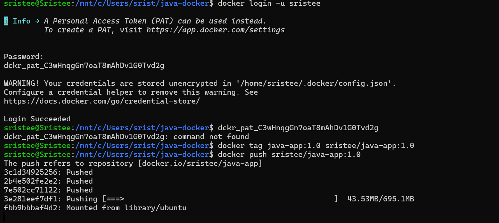

# 🐳 Java Docker App – Class Task


## 🛠️ Technologies Used  
- Docker  
- Ubuntu 22.04 (Base Image)  
- OpenJDK 17  
- Java  

---

## 📂 Project Structure  
```
java-docker/
│── Dockerfile
│── Hello.java
```

---

## 🧾 Dockerfile  
```dockerfile
FROM ubuntu:22.04

RUN apt update && apt install -y openjdk-17-jdk

WORKDIR /home/app

COPY Hello.java .

RUN javac Hello.java

CMD ["echo", "Hello from version 2"]
```

---

## ⚙️ Steps Performed  

### 1️⃣ Build Docker Image  
```bash
docker build -t java-app:1.0 .
```

---

### 2️⃣ Run the Container  
```bash
docker run java-app:1.0
```

**Output:**  
```
Hello from Docker!
```

---

### 3️⃣ Run Container in Interactive Mode  
```bash
docker run -it java-app:1.0 bash
```

---

### 4️⃣ Login to Docker Hub  
```bash
docker login -u sristee
```
> Used Personal Access Token (PAT) instead of password.

---

### 5️⃣ Tag the Image  
```bash
docker tag java-app:1.0 sristee/java-app:1.0
```

---

### 6️⃣ Push Image to Docker Hub  
```bash
docker push sristee/java-app:1.0
```

---

## 🚀 Docker Hub Repository  
Image successfully pushed to:  
```
docker.io/sristee/java-app
```

---

## ⚠️ Notes  
- Docker may show a warning about storing credentials unencrypted.  
- Build used cached layers for faster execution.  
- CMD was modified to print a custom message (`Hello from version 2`).  

---

## ✅ Outcome  
- Successfully created and built a Docker image  
- Ran containers using the image  
- Authenticated with Docker Hub using PAT  
- Tagged and pushed the image to a remote repository  

---

## 📸 Screenshots  

> all screenshots below:








