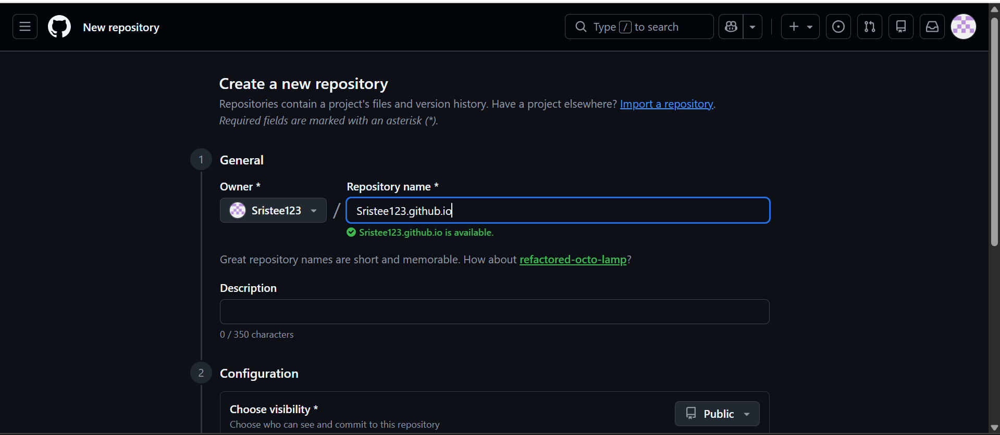
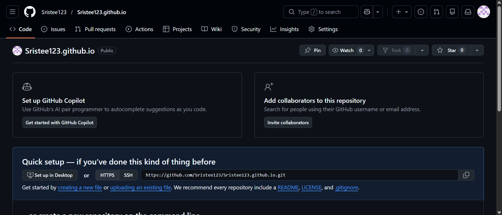
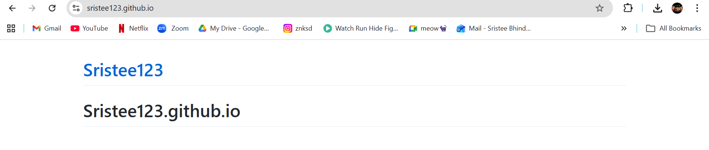
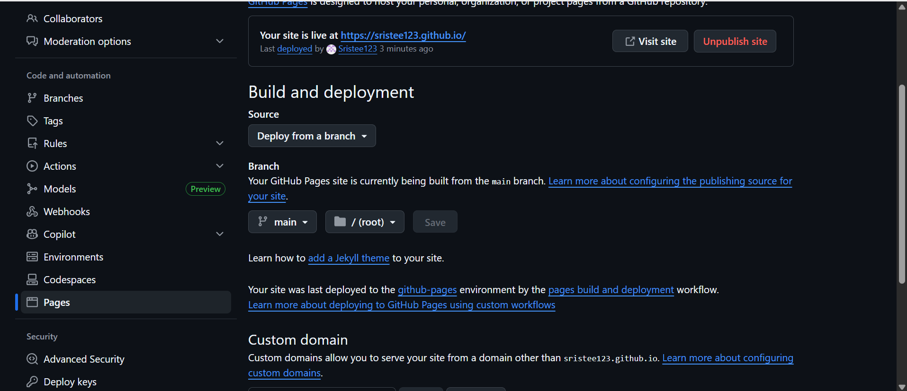

# 🌐 GitHub Pages Setup – Class Task


## 🛠️ Technologies Used  
- GitHub  
- GitHub Pages  
- HTML (default page rendering)  

---

## ⚙️ Steps Performed  

### 1️⃣ Create a New Repository  
- Created a repository named:  
```
Sristee123.github.io
```
> This naming convention is required for user GitHub Pages.

---

### 2️⃣ Initialize Repository  
- Repository created as **Public**  
- No initial files added  

---

### 3️⃣ Add Content  
- Created a basic HTML file (`index.html`)  
- This file acts as the homepage of the website  

---

### 4️⃣ Enable GitHub Pages  
- Navigated to **Settings → Pages**  
- Selected:
  - Source: `Deploy from a branch`  
  - Branch: `main`  
  - Folder: `/ (root)`  

---

### 5️⃣ Deploy Website  
- GitHub automatically built and deployed the site  
- Deployment handled by GitHub Pages workflow  

---

## 🚀 Live Website  
Your site is live at:  
```
https://sristee123.github.io/
```

---

## ⚠️ Notes  
- Repository name must follow the format: `username.github.io`  
- Only the `main` branch was used for deployment  
- Changes pushed to the repository will automatically update the website  

---

## ✅ Outcome  
- Successfully created a GitHub repository  
- Configured GitHub Pages  
- Deployed a live personal website  
- Verified the site is accessible via the provided URL  

---

## 📸 Screenshots  

> all screenshots below:




